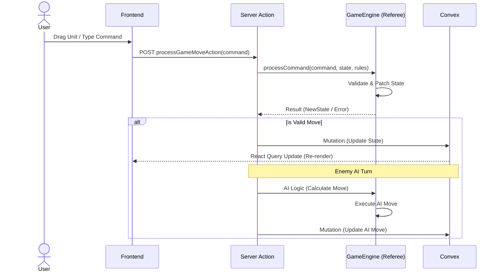

# Runtime Engine Architecture

The runtime engine handles the actual gameplay, including state synchronization, rule enforcement, and AI opponent behavior. It follows a **Server-Authoritative** model where the frontend is a dumb terminal that visualizes state and sends requests.

## 1. Frontend Loading & Visualization

**File**: `app/play/page.tsx`

The frontend bootstraps the game by fetching data from two sources:
1.  **Convex DB**: Primary source for the live `games` table (dynamic state, rules).
2.  **Asset Proxy**: Fallback/Static source for `navmesh.json` and images (served from `backend/data/runs/...`).

### Rendering Process
The state is transformed into a `SceneManifest` passed to the `<SmartScene />` component:
*   **Ambience Layer**: Background image (`background.png`).
*   **Zones Layer**: Debug overlays for the NavMesh tiles.
*   **Actor Layer**: Sprites (`entities`) positioned based on their geometric `pixel_box` or snapped logical location.

## 2. The Game Loop

Everything runs through the Backend Game Engine via **Server Actions**.

## 3. Interaction Flow

### User Actions
User inputs (drags or text) are converted into a standardized **Natural Language Command** by the frontend hook `useGameEngine`.
*   *Drag Event* -> "Move archer (id: 1) to tile_r2_c2"
*   *Text Input* -> "Attack the goblin with the wizard"

### Game Referee (The Engine)
**File**: `backend/llm/agents/game_referee.ts`

The Referee is a hybrid system combining deterministic logic and LLM reasoning.

1.  **State Enrichment**: The engine maps raw pixel coordinates to logical zones (e.g., `tile_r1_c1`) using the NavMesh.
2.  **Geometric Stripping**: Detailed pixel data is removed to reduce token usage.
3.  **LLM Processing**: The LLM evaluates the `Command` against the `Rules` and `State`.
4.  **Patches**: The LLM outputs **JSON Patches** (RFC 6902) to modify the state (e.g., update location logic).
5.  **Rehydration**: The backend re-calculates pixel coordinates for modified entities based on their new logical zones.

### Enemy AI
**File**: `backend/llm/agents/enemy_ai.ts`

This is triggered strictly after a valid user move.
1.  **Input**: The *new* game state (after user move).
2.  **Logic**: An LLM agent analyzes the board strategy.
3.  **Output**: A Natural Language Command (e.g., "Move skeleton to tile_r3_c3").
4.  **Execution**: This command is fed back into the Game Referee to ensure it follows the same rules as the player.
