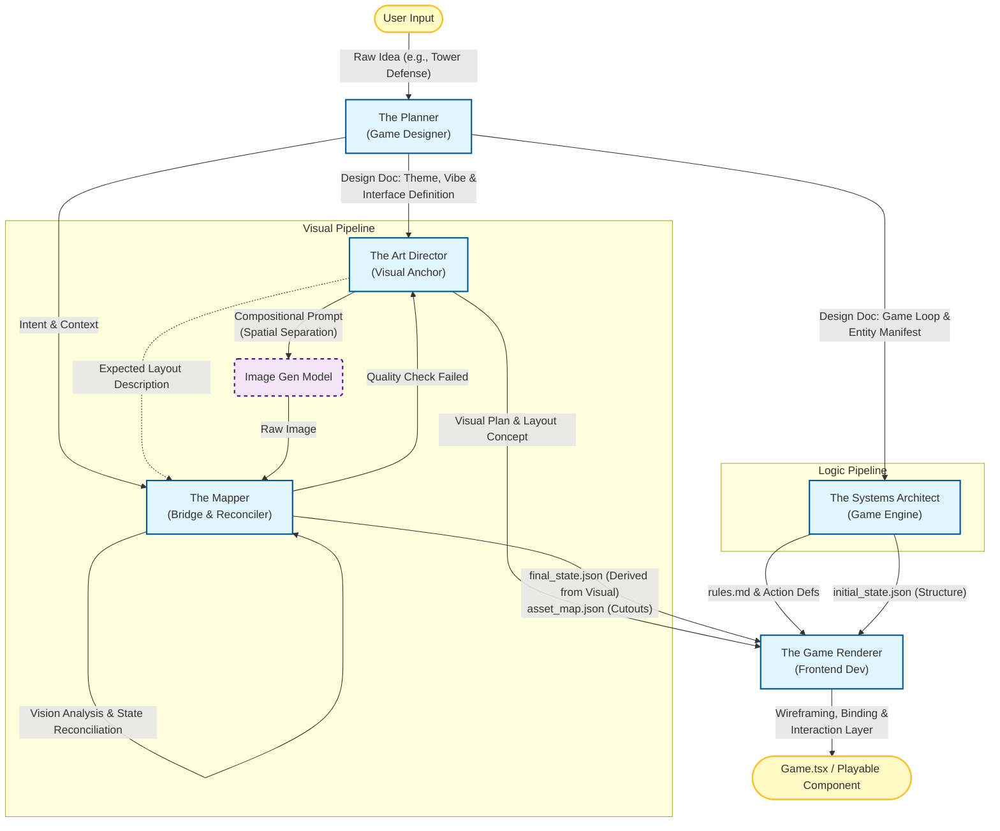

### Phase 1: The Generation Swarm (The "Studio")

This phase acts like a game development team. The goal is **consistency** between the visual representation and the JSON state.

#### 1. Agent: `The Planner` (Game Designer)

- **Role:** The visionary who defines the "rules of engagement" and the physical space.
- **Input:** User's raw idea (e.g., "A tower defense game with sushi chefs").
- **Responsibilities:**
  - **Theme & Atmosphere:** Describes the vibe (Cyberpunk, Medieval, Cute).
  - **Entity Manifest:** Lists every object needed (Unit types, resource counters, obstacles).
  - **Game Loop Definition:** How does a turn work? What is the win condition?
  - **CRITICAL - Interface Definition:** Explicitly describes the **Game Board Layout**.
    - *Example:* "The board is a 3-lane grid. The player's hand is at the bottom. The boss is at the top. A mana bar is on the left."
- **Output:** `Game_Design_Doc.md` (Structured text defining the board, entities, and rules).

#### 2. Agent: `The Systems Architect` (Game Engine)

- **Role:** The logic programmer.
- **Input:** The `Planner`'s Design Doc.
- **Responsibilities:**
  - **State Generation:** Translates the Planner's "Entity Manifest" into the `initial_state.json`.
  - **Rule Codification:** Translates the "Game Loop" into `rules.md`.
  - **Action Definition:** Defines valid JSON actions (e.g., `{ "type": "PLACE_UNIT", "lane": 1 }`).
- **Output:** `initial_state.json` + `rules.md`.

#### 3. Agent: `The Art Director` (The Visual Anchor)

- **Role:** The creative lead and "Truth Setter."
- **Input:** The `Planner`'s Design Doc (Theme, Vibe, Rough Requirements).
- **Strategy:** **Compositional Prompting**. It doesn't just ask for a "cool scene." It enforces spatial separation to make the Segmenter's job easier.
- **Responsibilities:**
  - **Scene Composition:** Generates a prompt that explicitly requests *separation* between game elements. (e.g., "A game board viewed from top-down. The background is a dark tavern table. Distinctly separated on the table are three glowing playing cards and one large monster token.")
  - **Visual Inventory:** Outputs a simple list of what *should* be in the image (e.g., `["card_slot_1", "card_slot_2", "boss_token"]`).
- **Output:**
  1. The **Image Prompt**.
  2. The **Expected Layout Description** (for the Mapper to verify).

#### 4. Agent: `The Mapper` (The Bridge & Reconciler)

- **Role:** The smartest agent in the pipeline. It uses **Vision-Language (VLM)** capabilities (like Gemini Pro Vision).
- **Input:** The Generated Image + The `Planner`'s Intent.
- **Strategy:** **"Scan, Tag, then Code"** (The Reverse Engineering approach).
- **Responsibilities:**
  - **Step 1: Vision Analysis:** It looks at the *actual* generated image. It counts the objects. "Okay, the image generator actually made 4 cards, not 3."
  - **Step 2: State Reconciliation (The "Latest Strategy" Part):** Instead of forcing the image to match a pre-written JSON, **it writes the JSON to match the image.**
    - *If image has 4 cards:* It generates 4 entries in `state.json`.
    - *If image has a red dragon:* It updates `state.json` boss stats to "Fire Element".
  - **Step 3: Segmentation (SAM/Nanobana):** Now that it knows what everything is, it runs the pixel-cutting (segmentation) to create `asset_01.png`, `asset_02.png`.
- **Output:**
  1. **`final_state.json`** (The *actual* game state derived from the visual).
  2. **`asset_map.json`** (Mapping IDs to file paths: `{"rat_minion_01": "assets/cutout_04.png"}`).

#### 5. Agent: `The Game Renderer` (Frontend Developer) **[NEW]**

- **Role:** The React engineer.
- **Input:**
  - **Visual Plan:** The `Art Director`'s layout concept.
  - **Data Structure:** The `Systems Architect`'s `initial_state.json`.
  - **Assets:** The mapped images from `The Mapper`.
- **Responsibilities:**
  - **Wireframing:** Writes the React code (`GameBoard.tsx`).
  - **Binding:** Connects the visual slots (divs/images) to the state data.
  - **Interaction Layer:** Defines the `onClick` handlers that trigger the actions defined by the Systems Architect.
- **Output:** `Game.tsx` (Playable React Component).

### The Implementation Spec (How to code it)

