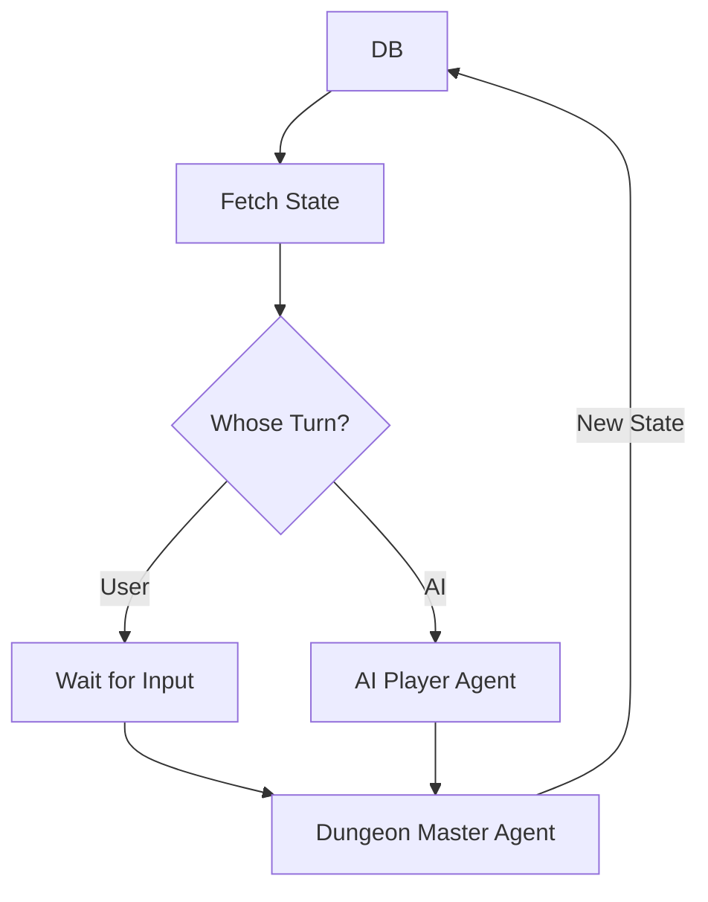

### Phase 2: The Interaction Swarm (The "Runtime")

This phase acts like a D&D session. It is a loop, not a linear path. We need an **Orchestrator Pattern** here to manage the "Game Loop."

#### 1. Agent: `The Dungeon Master` (Inference Engine)

* **Role:** The absolute source of truth.
* **Input:** * `Current State` (from Convex)
* `Incoming Action` (User or AI)
* `Game Rules` (Text)

* **Strategy:** ReAct (Reason + Act). It must "simulate" the logic in its head.
* **System Prompt Snippet:**
> "You are the Game Engine. You possess the State and the Rules.
> 1. VALIDATE: Is the user's action allowed by the rules?
> 2. SIMULATE: Apply the logic. Calculate damage, move positions.
> 3. UPDATE: Return the strictly formatted new JSON state."
> 
> 

#### 2. Agent: `The Narrator` (Game Renderer Helper)

* **Role:** Translator from State to UI.
* **Input:** New State.
* **Responsibilities:**
* Usually, React handles this deterministically. However, if you want "Adaptive UI" (as per your roadmap), this agent decides *how* to show the state.
* *Example:* If the player takes heavy damage, this agent injects a "screen_shake" or "red_vignette" flag into the UI state, even if the strict game rules didn't specify it.

#### 3. Agent: `The Rival` (AI Player)

* **Role:** The Opponent.
* **Input:** The *Public* Game State (it should not see the user's hidden cards/fog of war).
* **Strategy:** "Chain of Thought" with Persona.
* **System Prompt Snippet:**
> "You are the AI Player. Your goal is to win, but you must roleplay as [Persona: Aggressive Cyber-Rat].
> Review the board. Identify the optimal move. Output your action in natural language."

